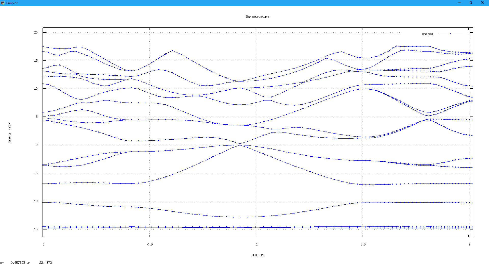

# 能带计算
#### 能带计算步骤
[示例下载](http://39.98.50.106/pwmat-resource/course-download/PWmat/tutorial_bandgap.zip)
能带计算一般需要进行两步：通过SCF计算得到收敛的电势文件（OUT.VR、OUT.VR_2，后者在spin=2才会产生)，将电势文件作为输入，进行NONSCF计算。将示例文件夹解压得到以下几个文件：
``` 
{
  unzip tutorial_bandgap.zip
  -------------------------------
  Archive:  tutorial_bandgap.zip
     creating: tutorial_bandgap/
    inflating: tutorial_bandgap/atom.config
    inflating: tutorial_bandgap/gen.kpt
    inflating: tutorial_bandgap/Ga.SG15.PBE.UPF
    inflating: tutorial_bandgap/As.SG15.PBE.UPF
    inflating: tutorial_bandgap/etot.input.nonscf
    inflating: tutorial_bandgap/etot.input.scf
    inflating: tutorial_bandgap/job.pbs
}
```
#### etot.input.scf---自洽计算控制文件
```
{
   1 4       <--这里由于K点数目较多，采用K点并行的方式进行计算
   job = scf
   in.psp1 = Ga.SG15.PBE.UPF
   in.psp2 = As.SG15.PBE.UPF
   in.atom = atom.config
   mp_n123 = 9 9 9 1 1 1
}
```
#### etot.input.nonscf---非自洽计算控制文件
```
{
   1 4
   job = nonscf
   in.psp1 = Ga.SG15.PBE.UPF
   in.psp2 = As.SG15.PBE.UPF
   in.atom = atom.config
   in.kpt = T       <--从IN.KPT中读取高对称K点
   in.vr = T        <--读取SCF得到电势文件IN.VR(将OUT.VR改名为IN.VR)
}
```
#### gen.kpt---产生高对称K点路径的输入文件
```
{
   band  # the Brillouin Zone Path: W-L-G-X-W-K，这是一个标识行，必须标识为band或者BAND
   15                        <--下面两个高对称点之间线性插入的点的数量
   0.500  0.250  0.750       <--第一个高对称点
   0.500  0.500  0.500       <--第二个高对称点
   15
   0.500  0.500  0.500
   0.000  0.000  0.000
   15
   0.000  0.000  0.000
   0.500  0.000  0.500
   15
   0.500  0.000  0.500
   0.500  0.250  0.750
   15
   0.500  0.250  0.750
   0.375  0.375  0.750	
}
```
#### 如何从gen.kpt得到IN.KPT文件
```
{
   split_kp.x < gen.kpt		
}
```
这里也提供另外一种自动产生高对称点的方法，可以参考[sumo](http://www.pwmat.com/tutorial-pwmat-sumo.html)的使用
#### job.pbs---提交作业的脚本文件
关于pbs作业调度使用可以参考PBS使用，job.pbs内容如下：
```
{
    #PBS -N GaAs-bandgap
    #PBS -l nodes=1:ppn=4
    #PBS -l walltime=10:00:00
    #PBS -q test
    #PBS -j oe
    
    cd $PBS_O_WORKDIR
    
    cp etot.input.scf etot.input   # do scf 
    mpirun -np 4 PWmat
    cp REPORT REPORT.SCF
    
    mv OUT.VR IN.VR
    cp etot.input.nonscf etot.input # do nonscf
    mpirun -np 4 PWmat
    cp REPORT REPORT.NONSCF
    
    rm etot.input		
}
```
提交作业
#### plot_band_structure.x---画能带图
运行plot_band_structure.x会得到bandstructure_1.txt数据文件（如果OUT.FERMI存在，会自动减去费米能）和bandstructure.eps文件
能图如下
