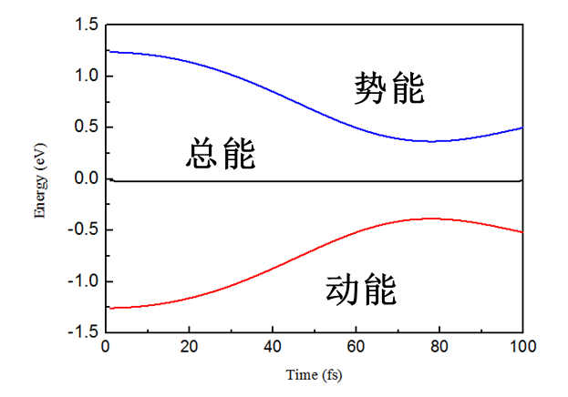

<font size=5><center>**分子动力学计算**</center></font>

PWmat进行分子动力学模拟主要是设置MD_DETAIL参数，介绍如下：
``` 
{
  MD_DETAIL = MD, NSTEP, DT, TEMP1, TEMP2
  
  MD控制MD算法，1是Verlet(NVE)；2是Nose-Hoover(NVT)；3是Langevin(NVT)；4是Constant pressure Langevin dynamics(NPT)；5是
  Constant pressure Nose-Hooover dynamics (NPT)；6是Berendsen dynamics (NVT)；7是Constant pressure Berendsen dynamics 
  （NPT）。
  NSTEP是MD的步数。
  DT是分子动力学的步长（单位是fs）。
  TEMP1是初态温度，当atom.config中没有提供例子的初始温度的时候，初始温度根据TEMP1随机产生。
  TEMP2是末态温度，对于NVE，末态温度不起作用，但是必须写，对于NVT和NPT系综该温度起作用，根据自己的需要设置
}
```
注：关于分子动力学的续算，设置MD=11/22/33/44/55/66/77，此外在atom.config还需包括每个原子的速度，可以从MOVEMENT中拷贝

下面以金属钠体系为例展示分子动力学过程：
首先准备结构文件atom.config
```
{
             16
   Lattice vector
         8.5811996460      0.0000000000      0.0000000000
         0.0000000000      8.5811996460      0.0000000000
         0.0000000000      0.0000000000      8.5811996460
   Position, move_x, move_y, move_z
     11    0.000000000000    0.000000000000    0.000000000000  1  1  1
     11    0.250000000000    0.250000000000    0.250000000000  1  1  1
     11    0.500000000000    0.000000000000    0.000000000000  1  1  1
     11    0.750000000000    0.250000000000    0.250000000000  1  1  1
     11    0.000000000000    0.500000000000    0.000000000000  1  1  1
     11    0.250000000000    0.750000000000    0.250000000000  1  1  1
     11    0.500000000000    0.500000000000    0.000000000000  1  1  1
     11    0.750000000000    0.750000000000    0.250000000000  1  1  1
     11    0.000000000000    0.000000000000    0.500000000000  1  1  1
     11    0.250000000000    0.250000000000    0.750000000000  1  1  1
     11    0.500000000000    0.000000000000    0.500000000000  1  1  1
     11    0.750000000000    0.250000000000    0.750000000000  1  1  1
     11    0.000000000000    0.500000000000    0.500000000000  1  1  1
     11    0.250000000000    0.750000000000    0.750000000000  1  1  1
     11    0.500000000000    0.500000000000    0.500000000000  1  1  1
     11    0.750000000000    0.750000000000    0.750000000000  1  1  1

}

```
etot.input文件如下：
```
{
    1 4
    IN.ATOM = atom.config
    JOB = MD
    MD_DETAIL = 1 1000 1 300 500
    MP_N123 = 3 3 3 0 0 0 2  #注意：进行分子动力学计算的时候，一般需要关闭K点对称性
    IN.PSP1 = Na.SG15.PBE.UPF
    Ecut = 50
    Ecut2 = 200
}

```
计算完成之后，主要查看MDSTEPS文件和MOVEMENT文件。MDSTEPS文件可以查看体系能量（对于NVT和NPT系综还可以查看温度以及压力）的变化情况：


在MOVEMENT文件中，可以找到分子动力学过程中所有原子的运动过程：
运行命令:convert_from_config.x < MOVEMENT，运行之后得到MOVEMENT.xyz和MOVEMENT.xsf，这两个文件可以用VMD或者XCRYDEN查看
