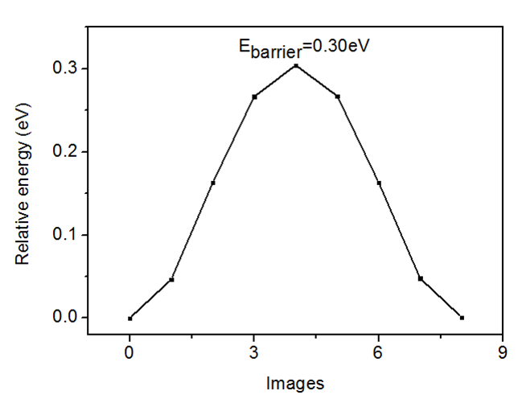
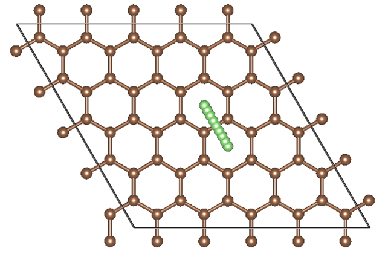

# NEB计算
[示例下载](http://www.pwmat.com/pwmat-resource/course-download/PWmat/neb.tar.gz)
#### NEB参数简介
PWmat采用的NEB方法主要参考H. Jonsson, G. Mills and K. W. Jacobsen. 'Nudged Elastic Band Method for Finding Minimum Energy Paths of Transitions' in 'Classical and 
Quantum Dynamics in Condensed Phase Simulations', ed. B. J. Berne, G. Ciccotti and D.F.Coker(World Scientic, 1998).
PWmat中控制NEB方法的主要参数是NEB_DETAIL，详解如下：
``` 
{
  NEB_DETAIL = IMTH, NSTEP, FORCE_TOL, NIMAGE, AK, TYPE_STRING, E0, EN, ITYPE_AT2, ATOM2.CONFIG
  IMTH：原子弛豫方法 1：CG；2：BFGS；3：deepest decent；4：VFF PCG；5：Limited-memory BFGS；6：FIRE。对于NEB计算，推荐使用1，5，6。
  NSTEP：原子弛豫的最大步数。
  FORCE_TOL：原子在弛豫过程中所受最大力的收敛条件。
  NIMAGE：NEB方法中image的数量。包括最初和最末原子位置，一共NIMAGE+2个atom.config。
  AK：spring常数（ev/A^2），推荐0.1~1eV/A^2。对于TYPE_STRING=2, 越大的AK，越容易收敛，同时误差更大。
  TYPE_SPRING：NEB方法 1：原始的NEB方法，去掉垂直string的力；2：传统的弹性力，类似弹簧的弹性力，垂直string的力没有去掉，
  该方法算出的势垒不准，但是很容收敛，对于路径复杂的体系，推荐先用该方法进行计算，然后用1或者3续算；3：常用的NEB算法，
  改进了切线的计算方法。
  E0、EN：相邻的局域能量最小值，一般通过RELAX获得。
  ITYPE_AT2，ATOM2.CONFIG：atom2.config的类型和atom2.config的文件名。
            ITYPE_AT2=1，atom2.config只包含第二个局域能量最小值的原子位置；
            ITYPE_AT2=2，atom2.config包含了NIMAGE+2个原子结构，这个文件一般从之前的计算得到的MOVEMENT中得到。
}
```
本例中，etot.input如下：
```
{
   1    4
   in.atom = atom1.config
   job = neb
   NEB_DETAIL = 5  1000  0.03  7  1  3  -0.7757706998E+04  -0.7757705948E+04   1  atom2.config
   in.psp1 = C.pwm
   in.psp2 = Li.pwm
   xcfunctional = pbe
   mp_n123 = 3 3 1 0 0 0 2
}
```
atom1.config文件如下：
```
{
     51 atoms,Iteration =  11, Etot,Ep,Ek =  -0.7757706998E+04  -0.7757706998E+04   0.0000000000E+00, Average Force=  0.32248E-02, Max force=  0.87781E-02
    Lattice vector
      0.1230000019E+02    0.0000000000E+00    0.0000000000E+00
     -0.6150000095E+01    0.1065211263E+02    0.0000000000E+00
      0.0000000000E+00    0.0000000000E+00    0.2000000000E+02
    Position, move_x, move_y, move_z
      6    0.133142617    0.066550336    0.000464871     1  1  1
      6    0.066577275    0.133281558    0.000473668     1  1  1
      6    0.333022997    0.066245290    0.000461013     1  1  1
      6    0.266253378    0.133008852    0.000458568     1  1  1
      6    0.533257523    0.066283732    0.000427583     1  1  1
      6    0.466195672    0.132368633    0.000493054     1  1  1
      6    0.733367778    0.066528002    0.000482659     1  1  1
      6    0.666723626    0.133013118    0.000433463     1  1  1
      6    0.933337946    0.066661868    0.000485984     1  1  1
      6    0.866716191    0.133283875    0.000486780     1  1  1
      6    0.133141433    0.266573561    0.000479551     1  1  1
      6    0.066659758    0.333387629    0.000496146     1  1  1
      6    0.332367334    0.266210649    0.000526052     1  1  1
      6    0.266309037    0.333247893    0.000464925     1  1  1
      6    0.532919358    0.265805060    0.000090451     1  1  1
      6    0.465806145    0.332915473    0.000108997     1  1  1
      6    0.733796120    0.266203993    0.000478750     1  1  1
      6    0.667094406    0.332905567    0.000069710     1  1  1
      6    0.933472003    0.266632227    0.000482655     1  1  1
      6    0.866986796    0.333276266    0.000433453     1  1  1
      6    0.133290485    0.466611195    0.000467164     1  1  1
      6    0.066849087    0.533402816    0.000448716     1  1  1
      6    0.333042815    0.466736023    0.000435380     1  1  1
      6    0.266562961    0.533405511    0.000437554     1  1  1
      6    0.532910847    0.467089469    0.000099345     1  1  1
      6    0.466190670    0.533809056    0.000489878     1  1  1
      6    0.734195075    0.467080654    0.000090426     1  1  1
      6    0.667084214    0.534193718    0.000109020     1  1  1
      6    0.933716359    0.466742657    0.000427549     1  1  1
      6    0.867631405    0.533804226    0.000492987     1  1  1
      6    0.133401645    0.666690630    0.000465271     1  1  1
      6    0.066813418    0.733408921    0.000485436     1  1  1
      6    0.333297595    0.666702605    0.000424841     1  1  1
      6    0.266672750    0.733327186    0.000461131     1  1  1
      6    0.533263976    0.666957175    0.000435398     1  1  1
      6    0.466594197    0.733436864    0.000437552     1  1  1
      6    0.733789367    0.667632627    0.000526125     1  1  1
      6    0.666752021    0.733690750    0.000464961     1  1  1
      6    0.933754762    0.666977106    0.000460998     1  1  1
      6    0.866991105    0.733746380    0.000458579     1  1  1
      6    0.133296803    0.866703123    0.000494927     1  1  1
      6    0.066686211    0.933313859    0.000478947     1  1  1
      6    0.333309310    0.866598327    0.000465261     1  1  1
      6    0.266590964    0.933186374    0.000485434     1  1  1
      6    0.533388887    0.866709443    0.000467155     1  1  1
      6    0.466597011    0.933150851    0.000448707     1  1  1
      6    0.733426595    0.866858662    0.000479549     1  1  1
      6    0.666612232    0.933340103    0.000496146     1  1  1
      6    0.933449580    0.866857250    0.000464868     1  1  1
      6    0.866718316    0.933422715    0.000473664     1  1  1
      3    0.599982328    0.400017749    0.083147361     1  1  1

}
```
atom2.config文件如下：
```
{
     51 atoms,Iteration =  12, Etot,Ep,Ek =  -0.7757705948E+04  -0.7757705948E+04   0.0000000000E+00, Average Force=  0.32859E-02, Max force=  0.97001E-02
    Lattice vector
      0.1230000019E+02    0.0000000000E+00    0.0000000000E+00
     -0.6150000095E+01    0.1065211263E+02    0.0000000000E+00
      0.0000000000E+00    0.0000000000E+00    0.2000000000E+02
    Position, move_x, move_y, move_z
      6    0.133303428    0.066693690    0.000431330     1  1  1
      6    0.066681046    0.133303836    0.000451800     1  1  1
      6    0.333311289    0.066561626    0.000362112     1  1  1
      6    0.266544345    0.133148474    0.000370194     1  1  1
      6    0.533400933    0.066691014    0.000308702     1  1  1
      6    0.466602361    0.133155668    0.000285824     1  1  1
      6    0.733375293    0.066826723    0.000483379     1  1  1
      6    0.666593161    0.133295586    0.000315395     1  1  1
      6    0.933460150    0.066856158    0.000510445     1  1  1
      6    0.866710443    0.133414849    0.000486216     1  1  1
      6    0.133154557    0.266561450    0.000479362     1  1  1
      6    0.066560029    0.333311813    0.000517572     1  1  1
      6    0.333043999    0.266336043    0.000389354     1  1  1
      6    0.266315863    0.333048909    0.000456319     1  1  1
      6    0.533281857    0.266298904    0.000301433     1  1  1
      6    0.466189972    0.332411044    0.000426745     1  1  1
      6    0.733410394    0.266591217    0.000272554     1  1  1
      6    0.666754479    0.333057244    0.000284130     1  1  1
      6    0.933381544    0.266720311    0.000456756     1  1  1
      6    0.866726628    0.333336840    0.000338759     1  1  1
      6    0.133163597    0.466618548    0.000503780     1  1  1
      6    0.066707465    0.533402959    0.000414715     1  1  1
      6    0.332405131    0.466206195    0.000542536     1  1  1
      6    0.266294020    0.533290644    0.000522249     1  1  1
      6    0.532931005    0.465849624    0.000080596     1  1  1
      6    0.465833668    0.532935661    0.000132526     1  1  1
      6    0.733840777    0.466211369    0.000411687     1  1  1
      6    0.667099574    0.532957815    0.000085545     1  1  1
      6    0.933466350    0.466608922    0.000343937     1  1  1
      6    0.867001284    0.533276784    0.000363441     1  1  1
      6    0.133322122    0.666604397    0.000443588     1  1  1
      6    0.066833368    0.733381064    0.000485965     1  1  1
      6    0.333055753    0.666757417    0.000521172     1  1  1
      6    0.266583979    0.733405547    0.000488389     1  1  1
      6    0.532948172    0.667117215    0.000205083     1  1  1
      6    0.466202041    0.733833453    0.000630483     1  1  1
      6    0.734184343    0.667129361    0.000150447     1  1  1
      6    0.667117827    0.734195178    0.000220166     1  1  1
      6    0.933789820    0.666771397    0.000452448     1  1  1
      6    0.867661783    0.733861556    0.000554202     1  1  1
      6    0.133425414    0.866712178    0.000515166     1  1  1
      6    0.066846993    0.933461674    0.000514765     1  1  1
      6    0.333335737    0.866717559    0.000466561     1  1  1
      6    0.266715379    0.933366962    0.000458545     1  1  1
      6    0.533272329    0.867001297    0.000578249     1  1  1
      6    0.466602345    0.933448156    0.000449585     1  1  1
      6    0.733847742    0.867657394    0.000662403     1  1  1
      6    0.666749886    0.933772877    0.000605763     1  1  1
      6    0.933745642    0.867004504    0.000541861     1  1  1
      6    0.866991275    0.933743592    0.000560664     1  1  1
      3    0.600093139    0.599824400    0.083288100     1  1  1
}
```
计算最后得到的NEB.BARRIER文件保存了每一个离子步的BARRIER，文件内容如下：
```
{
   iter=           0  Etot(eV),dist(Bohr),angle(cos(th))
        0      -0.77577069980000E+04    0.580683E+00   0.000000E+00
        1      -0.77576263442945E+04    0.580948E+00   0.999683E+00
        2      -0.77574511499979E+04    0.581046E+00   0.999911E+00
        3      -0.77572746348831E+04    0.580636E+00   0.999623E+00
        4      -0.77572061595077E+04    0.580631E+00   0.999307E+00
        5      -0.77572800952011E+04    0.581060E+00   0.999580E+00
        6      -0.77574593399529E+04    0.580979E+00   0.999903E+00
        7      -0.77576340810953E+04    0.580678E+00   0.999632E+00
        8      -0.77577059480000E+04    0.000000E+00   0.000000E+00
    --------------------------------------
    ...
   iter=          18  Etot(eV),dist(Bohr),angle(cos(th))
        0      -0.77577069980000E+04    0.622180E+00   0.000000E+00
        1      -0.77576605612282E+04    0.607070E+00   0.908650E+00
        2      -0.77575437847480E+04    0.617554E+00   0.986782E+00
        3      -0.77574404030711E+04    0.595882E+00   0.992912E+00
        4      -0.77574025935566E+04    0.597031E+00   0.986844E+00
        5      -0.77574395936331E+04    0.620330E+00   0.993238E+00
        6      -0.77575437662440E+04    0.601927E+00   0.987007E+00
        7      -0.77576591097449E+04    0.624035E+00   0.902604E+00
        8      -0.77577059480000E+04    0.000000E+00   0.000000E+00
    --------------------------------------
}
```
将最后（第16步）的BARRIER数据导出为FINAL.BARRIER如下：
```
{
        0      -0.77577069980000E+04    0.622180E+00   0.000000E+00
        1      -0.77576605612282E+04    0.607070E+00   0.908650E+00
        2      -0.77575437847480E+04    0.617554E+00   0.986782E+00
        3      -0.77574404030711E+04    0.595882E+00   0.992912E+00
        4      -0.77574025935566E+04    0.597031E+00   0.986844E+00
        5      -0.77574395936331E+04    0.620330E+00   0.993238E+00
        6      -0.77575437662440E+04    0.601927E+00   0.987007E+00
        7      -0.77576591097449E+04    0.624035E+00   0.902604E+00
        8      -0.77577059480000E+04    0.000000E+00   0.000000E+00		
}
```
利用origin或者gnuplot画图：


NEB计算过程中的结构均保存在MOVEMENT文件中，MOVEMENT格式如下：
```angularjs
   3 atoms,Iteration =   0 image=   0, Etot =  -0.4396318075E+02, Average Force=  0.23814E+00, Max force=  0.55146E+00
   ...
   3 atoms,Iteration =   0 image=   1, Etot =  -0.4388774304E+02, Average Force=  0.23814E+00, Max force=  0.55146E+00
   ...
   3 atoms,Iteration =   0 image=   2, Etot =  -0.4388774304E+02, Average Force=  0.23814E+00, Max force=  0.55146E+00
   ...
   ...
   3 atoms,Iteration =  16 image=   8, Etot =  -0.4396233569E+02, Average Force=  0.32458E-02, Max force=  0.84249E-02
```

NEB计算过程中收敛过程的数据保存在RELAXSTEPS里面，内容如下：
```angularjs
It=   0  NEW E= -0.4391433473709E+02 Av_F= 0.24E+00 M_F= 0.55E+00 dE=.3E-05 dRho=.8E-03 SCF= 4 dL=-.12E+00 p*F= 0.17E-01 p*F0=-0.45E-01 Fch= 0.10E+01
It=   1 CORR E= -0.4391260758048E+02 Av_F= 0.30E+00 M_F= 0.59E+00 dE=.2E-06 dRho=.2E-03 SCF= 3 dL=-.48E-01 p*F=-0.22E-01 p*F0=-0.45E-01 Fch= 0.99E+00
It=   2 CORR E= -0.4391590002211E+02 Av_F= 0.25E-01 M_F= 0.56E-01 dE=.5E-06 dRho=.7E-04 SCF= 3 dL=-.87E-01 p*F=-0.55E-03 p*F0=-0.45E-01 Fch= 0.99E+00
...
It=  14 CORR E= -0.4391581508122E+02 Av_F= 0.40E-02 M_F= 0.11E-01 dE=.5E-06 dRho=.6E-06 SCF= 2 dL=-.12E-02 p*F= 0.75E-05 p*F0=-0.39E-03 Fch=-0.87E+01
It=  15  NEW E= -0.4391580592798E+02 Av_F= 0.32E-02 M_F= 0.84E-02 dE=.6E-06 dRho=.8E-06 SCF= 2 dL=0.98E-03 p*F=-0.94E-04 p*F0=-0.29E-03 Fch=-0.93E+01
It=  16 *END E= -0.4391580592798E+02 Av_F= 0.32E-02 M_F= 0.84E-02 dE=.6E-06 dRho=.8E-06 SCF= 2 dL=0.98E-03 p*F=-0.94E-04 p*F0=-0.29E-03 Fch=-0.93E+01
			
```

和弛豫计算类似，一般也是参考能量（E）和最大力（M_F）的变化观察收敛情况。
