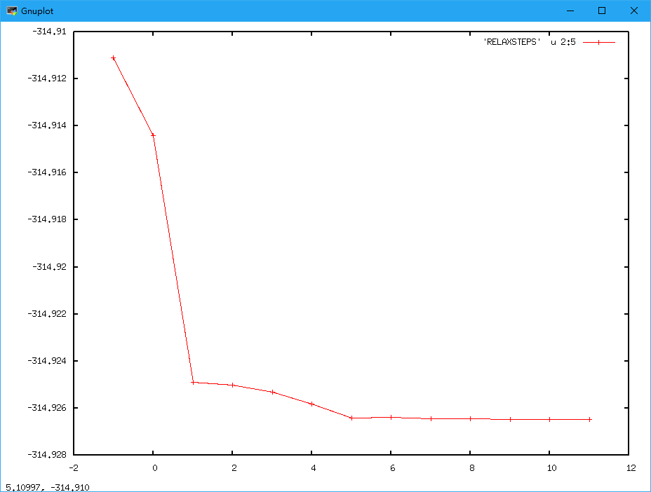

# 原子位置优化
[示例下载](http://39.98.50.106/pwmat-resource/course-download/PWmat/NH3-relax.zip)
PWmat进行原子弛豫主要通过设置RELAX_DETAIL来完成。RELAX_DETAIL主要介绍如下：
``` 
{
  RELAX DETAIL=IMTH, NSTEP, FORCE_TOL
  IMTH控制原子弛豫的方式，IMTH=1，CG方法；IMTH=2，BFGS方法；IMTH=3，最速下降法（一般用于NEB计算之中）
  NSTEP弛豫的最大步数
  FORCE_TOL弛豫收敛终止条件，PWmat主要通过对晶格中所有原子受到的最大的力小于FORCE_TOL判断来终止计算。单位eV/A。
}
```
本例中，etot.input如下：
```
{
   1 1
   job = relax
   relax_detail = 1 100 0.01
   in.psp1 = ONCV.PWM.H.UPF
   in.psp2 = ONCV.PWM.N.UPF
}
```
atom1.config文件如下：
```
{
     4
      LATTICE
           6.00000000     0.00000000     0.00000000
           0.00000000     7.00000000     0.00000000
           0.00000000     0.00000000     8.00000000
      POSITION
        1     0.63642900     0.56744600     0.54920500 1 1 1 --- 表示在x y z三个方向上移动原子
        1     0.50000000     0.36489600     0.54920500 1 1 1
        1     0.36357100     0.56744600     0.54920500 1 1 1
        7     0.50000000     0.50000000     0.50000000 0 0 0 --- 表示在x y z三个方向上固定原子
}
```
弛豫结束后会得到几个主要文件
```
{
     REPORT            主要输出信息
     RELAXSTEPS        弛豫过程能量和力的收敛信息
     MOVEMENT          弛豫过程原子和晶格变化
     final.config      弛豫结束得到的最终结构
}
```
其中RELAXSTEPS
```
{
   It=  -1 CORR E= -0.3149111174830E+03 Av_F= 0.34E+00 M_F= 0.55E+00 dE=.2E-04 dRho=.1E-03 SCF=21 dL=0.00E+00 p*F= 0.00E+00 p*F0= 0.00E+00 Fch= 0.00E+00
   It=   0  NEW E= -0.3149144315197E+03 Av_F= 0.32E+00 M_F= 0.54E+00 dE=.9E-05 dRho=.2E-03 SCF=10 dL=0.54E-01 p*F= 0.18E-01 p*F0=-0.20E-01 Fch= 0.17E+01
   It=   1 CORR E= -0.3149248794329E+03 Av_F= 0.47E-01 M_F= 0.73E-01 dE=.2E-04 dRho=.3E-03 SCF= 4 dL=0.27E-01 p*F=-0.22E-02 p*F0=-0.20E-01 Fch= 0.10E+01
   It=   2 CORR E= -0.3149250178000E+03 Av_F= 0.33E-01 M_F= 0.53E-01 dE=.9E-06 dRho=.1E-03 SCF= 3 dL=0.29E-01 p*F=-0.31E-04 p*F0=-0.20E-01 Fch= 0.10E+01
   It=   3  NEW E= -0.3149253168721E+03 Av_F= 0.34E-01 M_F= 0.46E-01 dE=.6E-06 dRho=.2E-02 SCF= 4 dL=-.28E-02 p*F=-0.16E-02 p*F0=-0.19E-02 Fch= 0.13E+01
   It=   4 CORR E= -0.3149258159599E+03 Av_F= 0.22E-01 M_F= 0.32E-01 dE=.9E-05 dRho=.7E-03 SCF=11 dL=-.11E-01 p*F=-0.12E-02 p*F0=-0.19E-02 Fch= 0.97E+00
   It=   5 CORR E= -0.3149264041001E+03 Av_F= 0.10E-01 M_F= 0.25E-01 dE=.2E-04 dRho=.6E-03 SCF= 4 dL=-.28E-01 p*F=-0.29E-03 p*F0=-0.19E-02 Fch= 0.95E+00
   It=   6  NEW E= -0.3149263727785E+03 Av_F= 0.20E-01 M_F= 0.48E-01 dE=.4E-05 dRho=.2E-03 SCF= 8 dL=-.34E-02 p*F= 0.95E-03 p*F0=-0.60E-03 Fch= 0.16E+01
   It=   7 CORR E= -0.3149264405946E+03 Av_F= 0.59E-02 M_F= 0.11E-01 dE=.1E-04 dRho=.9E-04 SCF= 2 dL=-.13E-02 p*F= 0.11E-04 p*F0=-0.60E-03 Fch= 0.29E+01
   It=   8  NEW E= -0.3149264385824E+03 Av_F= 0.53E-02 M_F= 0.10E-01 dE=.4E-05 dRho=.1E-03 SCF= 2 dL=-.59E-03 p*F=-0.28E-03 p*F0=-0.32E-03 Fch=-0.24E+00
   It=   9 CORR E= -0.3149264546261E+03 Av_F= 0.64E-02 M_F= 0.11E-01 dE=.2E-04 dRho=.6E-04 SCF= 2 dL=-.24E-02 p*F=-0.11E-03 p*F0=-0.32E-03 Fch= 0.59E+00
   It=  10  NEW E= -0.3149264654485E+03 Av_F= 0.53E-02 M_F= 0.75E-02 dE=.8E-06 dRho=.7E-04 SCF= 2 dL=0.11E-02 p*F= 0.15E-03 p*F0=-0.37E-03 Fch= 0.23E+01
   It=  11 *END E= -0.3149264654485E+03 Av_F= 0.53E-02 M_F= 0.75E-02 dE=.8E-06 dRho=.7E-04 SCF= 2 dL=0.11E-02 p*F= 0.15E-03 p*F0=-0.37E-03 Fch= 0.23E+01
   E表示每一离子步的能量
   Av_F表示每一离子步的所有原子的平均受力
   M_F表示每一离子步的所有原子受力的最大值
   dE表示每一离子步的能量收敛精度
   dRho表示每一离子步的电荷密度收敛精度
   CORR表示该离子步进行的是沿原方向的优化
   NEW表示该离子步进行的是沿新方向的优化
}
```
其中MOVEMENT的文件内容如下：
```
{
        ... ...
         -------------------------------------------------
           4 atoms,Iteration =  11, Etot,Ep,Ek =  -0.3149264654E+03  -0.3149264654E+03   0.0000000000E+00, Average Force=  0.52675E-02, Max force=  0.74774E-02
         Lattice vector
           0.6000000000E+01    0.0000000000E+00    0.0000000000E+00
           0.0000000000E+00    0.7000000000E+01    0.0000000000E+00
           0.0000000000E+00    0.0000000000E+00    0.8000000000E+01
         Position, move_x, move_y, move_z
           1    0.635137839    0.566808031    0.546486462     1  1  1
           1    0.500000007    0.366235248    0.546470909     1  1  1
           1    0.364862200    0.566808011    0.546486427     1  1  1
           7    0.500000000    0.500000000    0.500000000     0  0  0
         Force
           1    0.006841973    0.003701234    0.007477403
           1   -0.000001389    0.001232358    0.003952336
           1   -0.006832077    0.003692655    0.007472506
           7   -0.000014388   -0.011938070   -0.016130446
         -------------------------------------------------
           4 atoms,Iteration =  12, Etot,Ep,Ek =  -0.3149264654E+03  -0.3149264654E+03   0.0000000000E+00, Average Force=  0.52675E-02, Max force=  0.74774E-02
         Lattice vector
           0.6000000000E+01    0.0000000000E+00    0.0000000000E+00
           0.0000000000E+00    0.7000000000E+01    0.0000000000E+00
           0.0000000000E+00    0.0000000000E+00    0.8000000000E+01
         Position, move_x, move_y, move_z
           1    0.635137839    0.566808031    0.546486462     1  1  1
           1    0.500000007    0.366235248    0.546470909     1  1  1
           1    0.364862200    0.566808011    0.546486427     1  1  1
           7    0.500000000    0.500000000    0.500000000     0  0  0
         Force
           1    0.006841973    0.003701234    0.007477403
           1   -0.000001389    0.001232358    0.003952336
           1   -0.006832077    0.003692655    0.007472506
           7   -0.000014388   -0.011938070   -0.016130446
         -------------------------------------------------
}
```
 final.config内容和atom.config内容格式相同。

画图查看弛豫过程的收敛信息可以通过gnuplot命令：gnuplot
```
{
       gnuplot RELAXSTEPS u 2:5 w lp   
}
```
会得到如下能量变化的图
```
{
       gnuplot RELAXSTEPS u 2:9 w lp   
}
```


会得到如下最大受力变化的图
