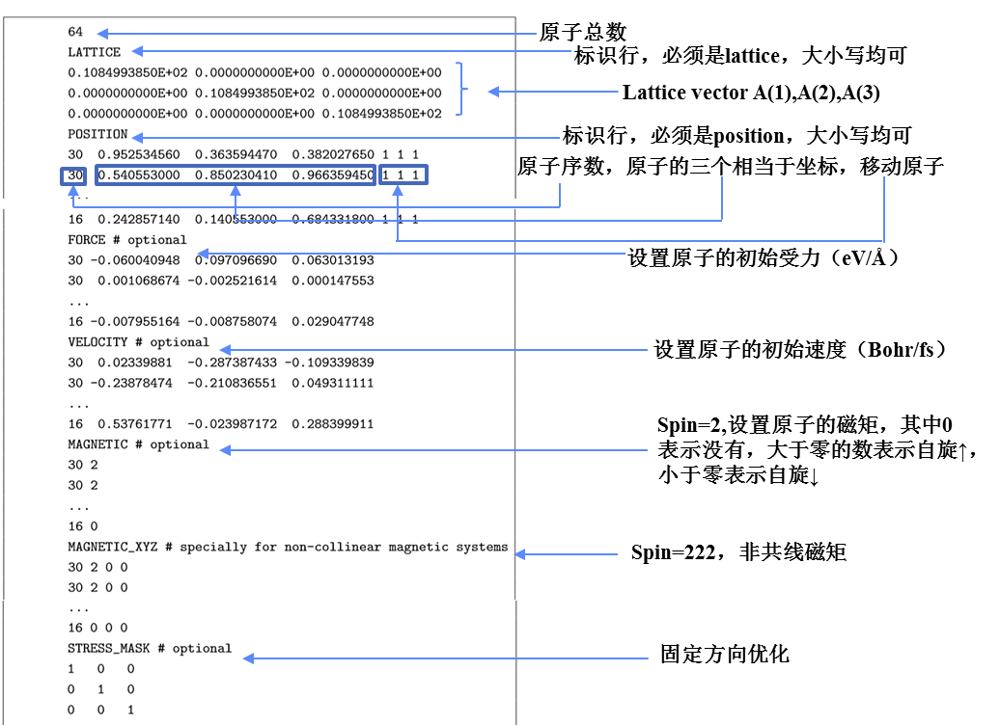

<font size=5><center>**基本输入输出**</center></font>

<font size=4>**一、基本输入文件**</font>
<font size=4><center>**atom.config---结构文件(必须的输入文件)**</center></font>

<font size=4>atom.config是PWmat需要的结构文件，其格式如下：</font>

&nbsp;

<font size=4><center>**etot.input---计算控制文件(必须的输入文件,而且名字必须为etot.input)**</center></font>
```
{
    1 1                         ! 波函数并行设置、K点并行设置，二者之积必须等于使用的GPU总数
    job = scf                   ! 计算类型设置，job为关键词，大小写均可；scf表示自洽计算，大小写均可
    in.psp1 = ONCV.PWM.As.UPF   ! 第一个赝势文件设置，in.psp1为关键词，大小写均可；ONCV.PWM.As.UPF为赝势文件名，必须和实际文件名一致
    in.psp2 = ONCV.PWM.Ga.UPF   ! 第二个赝势文件设置，赝势文件不必和atom.config对应
    in.atom = atom.config       ! 结构文件设置，in.atom是关键词，大小写均可；atom.config是文件名，必须和实际文件名一致
    mp_n123 =  5 5 5 0 0 0      ! K点设置，采用Monk-horst方法，mp_n123是关键词，大小写均可
}
```
&nbsp;

<font size=4><center>**赝势文件(必须的输入文件)**</center></font>

<font size=4>赝势文件部分内容如下：</font>
```
...
element="As"                                ! 赝势元素名称
pseudo_type="NC"                            ! 赝势类型，NC表示Norm-Conserving，模守恒赝势 US表示Ultra-Soft，超软赝势
relativistic="scalar"
is_ultrasoft="F"
is_paw="F"
is_coulomb="F"
has_so="F"
has_wfc="F"
has_gipaw="F"
core_correction="T"                         
functional="PBE"                            ! 生成赝势文件的泛函
z_valence="    5.00"                        ! 赝势的价电子数
total_psenergy="  -1.24422152418E+01"
wfc_cutoff="45.00"                          ! 赝势默认的截断能
rho_cutoff="   1.35700000000E+01"          
l_max="2"
...
```
&nbsp;

<font size=4><center>**job.pbs---提交作业的脚本文件(非必须的输入文件)**</center></font>

<font size=4>关于pbs作业调度使用可以参考[PBS使用](https://hongzhentian.github.io/PWmat-doc/#/MSTATION/TorqueUSE)，job.pbs内容如下：</font>
```
#PBS -N tutorial_basic-io   # 作业名
#PBS -l nodes=1:ppn=1       # PWmat将CPU和GPU进行绑定，所以ppn=1表示一个GPU
#PBS -l walltime=10:00:00   # 作业运行最大时间10h0min0sec
#PBS -q test                # 提交作业的队列test
cd $PBS_O_WORKDIR           # 切换到当前目录
mpirun -np 1 PWmat          # 运行PWmat
```
<font size=4>提交作业</font>
```
qsub job.pbs
-------------------
1.mstation
```
&nbsp;

<font size=4>PWmat还有其他输入文件，那些输入都是非必须，只有在特点计算的时候才会用到，例如，IN.RELAXOPT在施加外压的时候需提供，IN.KPT在计算能带的时候需要提供，IN.VEXT是施加外电场的时候需要提供的文件，其他更多输入文件，请参考手册上“IN.”开头的文件。</font>

&nbsp;

<font size=4>**二、输出文件**</font>


<font size=4>计算结束之后得到如下几个文件：</font>

文件名|内容
--|:--:
REPORT|主要输出文件，里面包含所有可以设置的参数，以及各步的迭代信息
OUT.KPT|K点坐标文件，里面包括了考虑对称性之后所使用的K点的坐标
OUT.SYMM|对称性文件，结构文件所给结构的所以对称性操作
OUT.RHO|&nbsp;&nbsp;&nbsp;&nbsp;&nbsp;&nbsp;&nbsp;&nbsp;&nbsp;&nbsp;&nbsp;&nbsp;&nbsp;&nbsp;&nbsp;&nbsp;&nbsp;&nbsp;电荷密度文件，二进制文件，可以使用utility提供的工具转化成VESTA可读的格式&nbsp;&nbsp;&nbsp;&nbsp;&nbsp;&nbsp;&nbsp;&nbsp;&nbsp;&nbsp;&nbsp;&nbsp;&nbsp;&nbsp;&nbsp;&nbsp;&nbsp;&nbsp;&nbsp;&nbsp;&nbsp;
OUT.WG|波函数文件，二进制文件，可以使用utility提供的工具进行可视化显示
OUT.EIGEN|本征值文件，二进制文件，计算DOS需要读取的文件
OUT.OCC|电子占据数文件，查看每个态的占据数
OUT.FERMI|费米能文件，里面存放了费米能级的位置
OUT.VR|电子势场文件，进行NONSCF计算的时候需要读取的文件
OUT.VATOM|原子中心势能，可以用于计算能阶，具体可以参考module中的band alignment
OUT.HSEWR(i)|Fock交换关联项的波函数，只有在使用杂化泛函HSE的时候才会输出，而且进行HSE杂化泛函的能带计算的时候需要读取
OUT.FORCE|原子的受力文件，输出顺序与atom.config中原子的排列顺序一致
OUT.STRESS|结构的应力张量，注意该文件中应力的单位是eV/Natom
RELAXSTEPS|进行原子位置、晶格优化以及NEB计算的时候产生的输出文件，里面有每步弛豫的信息
MDSTEPS|进行MD或者TDDFT计算时产生的输出文件，里面有每步MD的信息
MOVEMENT|结构优化、MD、NEB以及TDDFT计算中每个离子步的结构文件
final.config|弛豫后的结构文件
NEB.BARRIER|每步NEB中每个构象的能量
OUT.REAL.RHOWF_SP|输出电荷密度或者波函数在实空间的值
OUT.SPIN_X/Y/Z|每个r点出自旋电荷在x/y/z方向上的值
OUT.ATOMSPIN|在设置SPIN=222时，输出的每个原子的电荷和磁矩值

